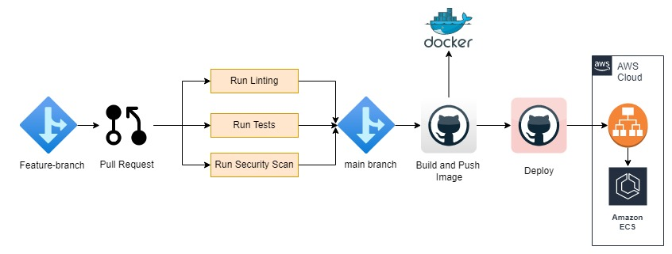

# Architecture Diagram

## Workflows
There are total 3 workflows
1. `pr.yaml` - Whenever any feature branch creates a pull request to `main` branch, pr.yaml gets executed. Following tests will run on creating pull request. If any test fails, Pull request won't be able to merge to main branch
   1. Code linting
   2. Unit tests
   3. Security scans
2. `build.yaml` - Whenever there is a push to main branch or any feature branch gets merged to main branch, this workflow gets triggered. this workflow does following jobs
   1. Builds docker image
   2. Push docker image to dockerhub. (Note: I haven't used ECR here)
   3. Run security scan for built image
3. `deploy.yaml` - If build.yaml workflow succeeds, then this workflow gets triggered. This workflow forces new deployment in ecs, which will pull latest image. (I don't have work experience in ECS, I have deployed as per my understanding)